# Service Authorization Guide

This guide explains how to configure fine-grained access control for services in your multi-cluster Istio mesh.

## Architecture Overview

```mermaid
graph TD
    User[End User] -->|HTTP GET| EdgeGW[Edge Gateway]

    %% Edge Cluster (external trust domain)
    subgraph Edge_Cluster["Edge Cluster (external.tetrate.io)"]
        EdgeGW[Edge Gateway<br/>Host: edge-bookinfo.sandbox.tetrate.io]
        SleepEdge[Sleep App]
        EdgeGW -->|mTLS| SleepEdge
    end

    %% Backend Cluster (internal trust domain)
    subgraph Backend_Cluster["Backend Cluster (internal.tetrate.io)"]
        subgraph Bookinfo_NS["bookinfo Namespace"]
            ProductPage[ProductPage Service]
            Reviews[Reviews Service]
            Details[Details Service]
            Ratings[Ratings Service]
            ProductPage --> Reviews
            ProductPage --> Details
            ProductPage --> Ratings
        end
        SleepBackend[Sleep App]
    end

    %% Authorization Policy Connections
    SleepBackend -.->|Allowed: internal.tetrate.io/*| ProductPage
    EdgeGW -.->|Allowed: Host=edge-bookinfo.sandbox.tetrate.io<br/>SA=istio-edge-gw| ProductPage
    SleepEdge -.->|❌ Denied: not in trust domain<br/>or host mismatch| ProductPage

    %% Styling
    classDef allowed fill:#e8f5e9,stroke:#4caf50,stroke-width:2px
    classDef denied fill:#ffebee,stroke:#f44336,stroke-width:2px
    classDef internet fill:#e3f2fd,stroke:#2196f3,stroke-width:2px

    linkStyle 0,1 stroke:#4caf50,stroke-width:2px
    linkStyle 2 stroke:#f44336,stroke-width:2px,stroke-dasharray: 5

    %% Legend
    subgraph Legend [ ]
        direction TB
        A[Allowed Connection<br/>by Trust Domain or Host + SA]:::allowed
        B[Denied Connection<br/>due to policy or principal mismatch]:::denied
    end
```


## Prerequisites

- Two Kubernetes clusters set up with Istio multi-cluster
- `kubectl` configured with access to both clusters
- Cluster contexts set as follows:
  ```sh
  export KUBECTX_CLUSTER1=aks-sw0-124-eastus-0  # Backend Cluster
  export KUBECTX_CLUSTER2=aks-sw0-124-eastus-1  # Edge Cluster
  ```

## 1. Internal Access Control

### Allow Internal Cluster Access

This policy allows access to the `bookinfo` namespace only from workloads within the `internal.tetrate.io` trust domain.

```sh
cat <<EOF | kubectl apply -f - --context $KUBECTX_CLUSTER1
apiVersion: security.istio.io/v1
kind: AuthorizationPolicy
metadata:
  name: allow-internal
  namespace: bookinfo
spec:
  action: ALLOW
  rules:
  - from:
    - source:
        principals: ["internal.tetrate.io/*"]
EOF
```

### Verify Internal Access

1. **From Backend Cluster**:
   ```sh
   kubectl exec -it $(kubectl get pod -l app=sleep -n sleep -o jsonpath='{.items[0].metadata.name}' --context $KUBECTX_CLUSTER1) \
     -n sleep --context $KUBECTX_CLUSTER1 -- \
     curl -I http://productpage.bookinfo:9080
   ```
   Expected: `HTTP/1.1 200 OK`

2. **From Edge Cluster**:
   ```sh
   kubectl exec -it $(kubectl get pod -l app=sleep -n sleep -o jsonpath='{.items[0].metadata.name}' --context $KUBECTX_CLUSTER2) \
     -n sleep --context $KUBECTX_CLUSTER2 -- \
     curl -I http://productpage.bookinfo:9080
   ```
   Expected: `HTTP/1.1 403 Forbidden`

## 2. External Access Control

### Allow External Access via Edge Gateway

This policy allows external access to the productpage service through the edge gateway, but only for GET requests to the specific hostname.

```sh
cat <<EOF | kubectl apply -f - --context $KUBECTX_CLUSTER1
apiVersion: security.istio.io/v1
kind: AuthorizationPolicy
metadata:
  namespace: bookinfo
  name: allow-ext-productpage
spec:
  selector:
    matchLabels:
      app: productpage
  action: ALLOW
  rules:
    - from:
      - source:
          principals: ["external.tetrate.io/ns/edge/sa/istio-edge-gw"]
      to:
      - operation:
          methods: ["GET"]
          hosts: ["edge-bookinfo.sandbox.tetrate.io"]
EOF
```

### Verify External Access

1. **Get Edge Gateway IP**:
   ```sh
   EDGE_IP=$(kubectl get svc -n edge -o jsonpath='{.items[0].status.loadBalancer.ingress[0].ip}' --context $KUBECTX_CLUSTER2)
   echo "Edge Gateway IP: $EDGE_IP"
   ```

2. **Test Access**:
   ```sh
   curl -I http://edge-bookinfo.sandbox.tetrate.io \
       --resolve "edge-bookinfo.sandbox.tetrate.io:80:$EDGE_IP" \
       -X GET
   ```
   Expected: `HTTP/1.1 200 OK`

3. **Test Without GET Method**:
   ```sh
   curl -I http://edge-bookinfo.sandbox.tetrate.io \
       --resolve "edge-bookinfo.sandbox.tetrate.io:80:$EDGE_IP"
   ```
   Expected: `HTTP/1.1 403 Forbidden`

## 3. Cleanup

To remove the authorization policies:

```sh
kubectl delete authorizationpolicy allow-internal -n bookinfo --context $KUBECTX_CLUSTER1
kubectl delete authorizationpolicy allow-ext-productpage -n bookinfo --context $KUBECTX_CLUSTER1
```

## Troubleshooting

- **403 Forbidden**: Verify the source principal and trust domain configuration
- **404 Not Found**: Check if the service and namespace exist
- **Connection Refused**: Verify the service is running and the port is correct

For more details, refer to the [Istio Authorization Documentation](https://istio.io/latest/docs/concepts/security/#authorization).