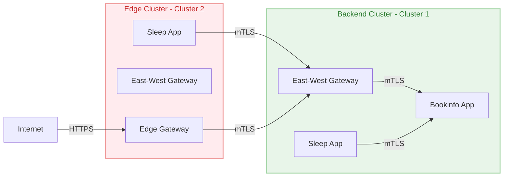

# Edge Gateway Configuration

## Architecture Overview



## Prerequisites

1. Set up cluster contexts:
   ```bash
  export KUBECTX_CLUSTER1=aks-swistio-mc-eastus-0   # Backend Cluster
  export KUBECTX_CLUSTER2=aks-swistio-mc-eastus-1  # Edge Cluster
   ```

## Configuration

### 1. Deploy Edge Gateway

Apply the following configuration to set up the Edge Gateway in the edge cluster:

```sh
cat << EOF | kubectl apply -f - --context $KUBECTX_CLUSTER2
---
# Edge Gateway
apiVersion: networking.istio.io/v1
kind: Gateway
metadata:
  name: edge-gw
  namespace: edge
spec:
  selector:
    istio: edge-gw
  servers:
  - port:
      number: 80
      name: http
      protocol: HTTP
    hosts:
    - "edge-bookinfo.sandbox.tetrate.io"

---
# Virtual Service for routing
apiVersion: networking.istio.io/v1
kind: VirtualService
metadata:
  name: edge-bookinfo-vs
  namespace: edge
spec:
  hosts:
  - "edge-bookinfo.sandbox.tetrate.io"
  gateways:
  - edge-gw
  http:
  - match:
    - uri:
        prefix: /
    route:
    - destination:
        host: productpage.bookinfo.svc.cluster.local
        port:
          number: 9080
EOF
```

### 2. Apply Configuration

```bash
kubectl apply -f edge-gateway.yaml --context $KUBECTX_CLUSTER2
```

## Verification

1. Get the external IP of the edge gateway:
```bash
EDGE_IP=$(kubectl get svc istio-edge-gw -n edge -o jsonpath='{.status.loadBalancer.ingress[0].ip}' --context $KUBECTX_CLUSTER2)
echo $EDGE_IP 
```

2. Test the edge gateway:
```bash
curl -I http://edge-bookinfo.sandbox.tetrate.io \
  --resolve "edge-bookinfo.sandbox.tetrate.io:80:$EDGE_IP"
```

## Security Notes

- All inter-service communication is secured with mTLS
- The edge cluster is considered less secure (red zone)
- The backend cluster is the secure zone (green zone)
- Traffic between clusters flows through east-west gateways