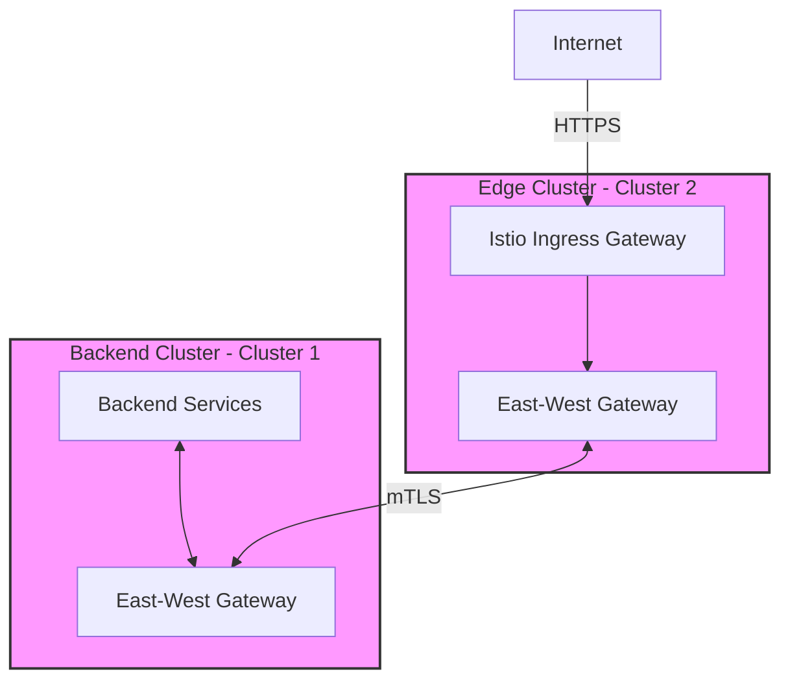

# Istio Multi-Cluster Deployment

This repository contains the configuration and deployment files for a multi-cluster Istio service mesh, featuring:

- **Cluster 1 (Backend)**: Hosts backend services and applications
- **Cluster 2 (Edge)**: Serves as the external-facing edge cluster with ingress capabilities

## Architecture Overview



## Features

- **Multi-Primary** configuration for high availability
- **mTLS** secured service-to-service communication
- **Centralized Certificate Management** using cert-manager
- **GitOps** workflow with ArgoCD
- **Multi-cluster Service Discovery**

## Prerequisites

- Two Kubernetes clusters (AKS, EKS, or GKE)
- `kubectl` configured with access to both clusters
- `istioctl` CLI installed
- `argocd` CLI installed (for ArgoCD management)
- Helm 3.x installed

## Cluster Configuration

### Cluster Contexts

```sh
export KUBECTX_CLUSTER1=aks-sw0-124-eastus-0  # Backend Cluster
export KUBECTX_CLUSTER2=aks-sw0-124-eastus-1  # Edge Cluster
```

## Installation

### 1. ArgoCD Installation

ArgoCD will be installed in both clusters to manage the GitOps workflow. The password is set to `Tetrite123` by default.

#### Backend Cluster (Cluster 1)

```sh
# Install ArgoCD in Cluster1
kubectl create namespace argocd --context $KUBECTX_CLUSTER1
kubectl apply -n argocd -f https://raw.githubusercontent.com/argoproj/argo-cd/stable/manifests/install.yaml --context $KUBECTX_CLUSTER1

# Wait for all ArgoCD pods to be ready (timeout after 5 minutes)
kubectl wait --for=condition=Ready pods --all -n argocd --timeout=300s --context $KUBECTX_CLUSTER1

# Update ArgoCD password (Tetrate123)
kubectl -n argocd patch secret argocd-secret --context $KUBECTX_CLUSTER1 \
  -p '{"stringData": {
    "admin.password": "$2a$10$GZ53dm6O8THQSqR7Mnrdo.UKkqyTVwM9PXPVj2ElPSCFH/owcwiOa",
    "admin.passwordMtime": "'$(date +%FT%T%Z)'"
  }}'
```

#### Edge Cluster (Cluster 2)

```sh
# Install ArgoCD in Edge Cluster
kubectl create namespace argocd --context $KUBECTX_CLUSTER2
kubectl apply -n argocd -f https://raw.githubusercontent.com/argoproj/argo-cd/stable/manifests/install.yaml --context $KUBECTX_CLUSTER2

# Wait for all ArgoCD pods to be ready (timeout after 5 minutes)
kubectl wait --for=condition=Ready pods --all -n argocd --timeout=300s --context $KUBECTX_CLUSTER2

# Update ArgoCD password (Tetrate123)
kubectl -n argocd patch secret argocd-secret --context $KUBECTX_CLUSTER2 \
  -p '{"stringData": {
    "admin.password": "$2a$10$GZ53dm6O8THQSqR7Mnrdo.UKkqyTVwM9PXPVj2ElPSCFH/owcwiOa",
    "admin.passwordMtime": "'$(date +%FT%T%Z)'"
  }}'
```

### 2. Certificate Management

#### Install Cert-manager

Step to install cert-manager and create a common CA for both clusters.

```sh
# Install cert-manager in Backend Cluster
kubectl apply -f clusters/cluster1/cert-manager.yaml --context $KUBECTX_CLUSTER1

# Install cert-manager in Edge Cluster
kubectl apply -f clusters/cluster2/cert-manager.yaml --context $KUBECTX_CLUSTER2

# Verify cert-manager pods are running in both clusters
# Check Backend Cluster
kubectl get pods -n cert-manager --context $KUBECTX_CLUSTER1

# Check Edge Cluster
kubectl get pods -n cert-manager --context $KUBECTX_CLUSTER2

# Wait for all cert-manager pods to be ready (timeout after 2 minutes)
kubectl wait --for=condition=Ready pods --all -n cert-manager --timeout=120s --context $KUBECTX_CLUSTER1
kubectl wait --for=condition=Ready pods --all -n cert-manager --timeout=120s --context $KUBECTX_CLUSTER2
```

### 3. Istio Installation

#### Backend Cluster (Cluster 1)

```sh
# Apply Istio base components
kubectl apply -f clusters/cluster1/istio.yaml --context $KUBECTX_CLUSTER1
```

Verify Istiod is deployed and ready
```sh
# Wait for Istio components to be ready
kubectl wait --for=condition=Ready pods --all -n istio-system --timeout=120s --context $KUBECTX_CLUSTER1
```

#### Edge Cluster (Cluster 2)

```sh
# Apply Istio base components
kubectl apply -f clusters/cluster2/istio.yaml --context $KUBECTX_CLUSTER2
```

Verify Istiod is deployed and ready
```sh
# Wait for Istio components to be ready
kubectl wait --for=condition=Ready pods --all -n istio-system --timeout=120s --context $KUBECTX_CLUSTER2
```

## Multi-Cluster Configuration

### 1. Enable Multi-Cluster Discovery

```sh
# Configure remote secret for Backend Cluster
istioctl create-remote-secret \
  --context=$KUBECTX_CLUSTER1 \
  --name=cluster1 | \
  kubectl apply -f - --context=$KUBECTX_CLUSTER2

# Configure remote secret for Edge Cluster
istioctl create-remote-secret \
  --context=$KUBECTX_CLUSTER2 \
  --name=cluster2 | \
  kubectl apply -f - --context=$KUBECTX_CLUSTER1
```

## Application Deployment

### Deploy Sample Application

#### Cluster1

```sh
# Deploy Demo Applications 
kubectl apply -f clusters/cluster1/bookinfo.yaml --context $KUBECTX_CLUSTER1
kubectl apply -f clusters/cluster1/sleep.yaml --context $KUBECTX_CLUSTER1
```

#### Cluster2

```sh
# Deploy Demo Applications 
kubectl apply -f clusters/cluster2/sleep.yaml --context $KUBECTX_CLUSTER2
```

### Test Traffic

#### Cluster 1

```sh
kubectl exec -it $(kubectl get pod -l app=sleep -n sleep -o jsonpath='{.items[0].metadata.name}' --context $KUBECTX_CLUSTER1) -n sleep --context $KUBECTX_CLUSTER1 -- curl http://productpage.bookinfo:9080 -I
# Expected Output
# HTTP/1.1 200 OK
# server: envoy
# date: Thu, 03 Jul 2025 18:15:54 GMT
# content-type: text/html; charset=utf-8
# content-length: 2080
# x-envoy-upstream-service-time: 8
```

#### Cluster 2

```sh
kubectl exec -it $(kubectl get pod -l app=sleep -n sleep -o jsonpath='{.items[0].metadata.name}' --context $KUBECTX_CLUSTER2) -n sleep --context $KUBECTX_CLUSTER2 -- curl http://productpage.bookinfo:9080 -I
# Expected Output
# curl: (6) Could not resolve host: productpage.bookinfo
```

### Enable East-West Gateway

```sh
# Cluster1
NAMESPACE=istio-eastwest-gateway
cat <<EOF | kubectl apply -n $NAMESPACE -f - --context $KUBECTX_CLUSTER1
apiVersion: networking.istio.io/v1
kind: Gateway
metadata:
  name: cross-network-gateway
spec:
  selector:
    istio: eastwest-gw
  servers:
    - port:
        number: 15443
        name: tls
        protocol: TLS
      tls:
        mode: AUTO_PASSTHROUGH
      hosts:
        - "*.local"
EOF

# Cluster2
NAMESPACE=istio-eastwest-gateway
cat <<EOF | kubectl apply -n $NAMESPACE -f - --context $KUBECTX_CLUSTER2
apiVersion: networking.istio.io/v1
kind: Gateway
metadata:
  name: cross-network-gateway
spec:
  selector:
    istio: eastwest-gw
  servers:
    - port:
        number: 15443
        name: tls
        protocol: TLS
      tls:
        mode: AUTO_PASSTHROUGH
      hosts:
        - "*.local"
EOF
```

## Verification

Verify the multi-cluster setup:

```sh
# Verify services are visible across clusters
kubectl get services --all-namespaces --context $KUBECTX_CLUSTER1
kubectl get services --all-namespaces --context $KUBECTX_CLUSTER2

# Test cross-cluster communication
kubectl exec -it $(kubectl get pod -l app=productpage -n bookinfo -o jsonpath='{.items[0].metadata.name}') -n bookinfo --context $KUBECTX_CLUSTER1 -- curl -sS http://reviews:9080/reviews/1 | jq
```


```